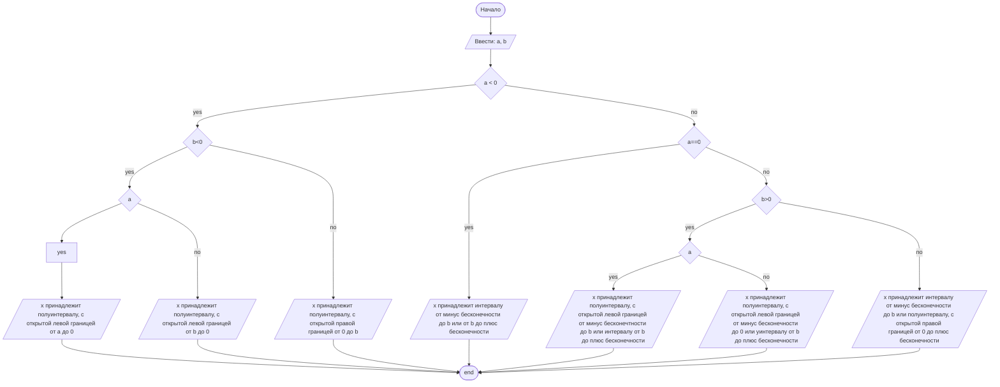

## Cодержание

1. [Отчет по лабораторной работе № 1](#отчет-по-лабораторной-работе--n)
2. [Критерии оценивания](#критерии-оценивания)

## Отчет по лабораторной работе № 1

#### № группы: `ПМ-2402`

#### Выполнил: `Гуськова Анастасия Павловна`

#### Вариант: `8`

### Cодержание:

- [Постановка задачи](#1-постановка-задачи)
- [Входные и выходные данные](#2-входные-и-выходные-данные)
- [Математическая модель](#25-математическая-модель)
- [Выбор структуры данных](#3-выбор-структуры-данных)
- [Алгоритм](#4-алгоритм)
- [Программа](#5-программа)
- [Анализ правильности решения](#6-анализ-правильности-решения)

### 1. Постановка задачи

- Условия задачи

> Дано неравенство: (a*x)/(x-b) >=0, где a и b - параметры(вводятся с клавиатуры). Решите его для x.

- Для того, чтобы решить это неарвенство необходимо рассмотреть все варианты того, какими могут быть a и b. Всего есть 7 вариантов:1.(a<b<0),2.(b<a<0),3.(a<0<b),4.(b<0<a),5.(0<a<b),6.(0<b<a),7.(a=0,b-любое число). 

### 2. Входные и выходные данные

Данные на вход:

- На вход программа должна получать 2 числа, при этом в условии не сказано, к какому множеству
  принадлежать получаемые числа, поэтому будем считать их вещественными. Также даны верхняя и нижняя границы получаемых
  чисел;

|             | Тип                | min значение    | max значение   |
|-------------|--------------------|-----------------|----------------|
| a (Число 1) | Вещественное число | 10<sup>9</sup>  | 10<sup>9</sup> |
| b (Число 2) | Вещественное число | -10<sup>9</sup> | 10<sup>9</sup> |

- Т.к. программа должна вывести промежуток значений х, то получать мы будем строку символов с вещественным числом (a или b), не превышающее 10<sup>9</sup>.

|         | Тип                | min значение    | max значение   |
|---------|--------------------|-----------------|----------------|
| Число 1 | Вещественное число | -10<sup>9</sup> | 10<sup>9</sup> |
| Строка  | String             |                 |                |

### 2,5. Математическая модель

В данной задаче можно обойтись без математической модели.

### 3. Выбор структуры данных

Программа получает 2 вещественных числа. Поэтому для их хранения
можно выделить 2 переменных (`а` и `b`) типа `double`.

|             | название переменной | Тип (в Java) | 
|-------------|---------------------|--------------|
| a (Число 1) | `a`                 | `double`     |
| b (Число 2) | `b`                 | `double`     | 

Для вывода результата необязательно его хранить в отдельной переменной.

### 4. Алгоритм

1. **Ввод данных:**  
   Программа считывает два вещественных числа, обозначенные как `a` и `b`.

2. **Проверка переменной a на отрицательность:**  
   Первым шагом рассматривается случай a=0 и b=0. Вторым шагом программа сравнивает a и 0. В случае положительного результата на проверку (a<0), выполняется проверка (b<0): если выражение ложно, на экран выводится x∈[0,b), если выражение верно - осуществляется сравнение (a<b), если (a<b) верно, на экран выводится x∈(а,0], если ложно - x∈(b,0].
В случае если (a<0) ложно выполняется проверка на (a==0), если (a=0), то на экран выводится x∈(-∞,)∪(b,∞), если (a!=0), осуществляется проверка (b<0): если выражение ложно на экран выводится x∈(-∞,b)∪[0,+∞), если (b<0) верно - проверяется выражение (a<b): если выражение верно на экран выводится x∈(-∞,0]∪(b,+∞), если ложно - x∈(-∞,0]∪(b,+∞).

#### Блок-схема





### 5. Программа

```java
import java.io.PrintStream;
import java.io.IOException;
import java.util.Scanner;
public class bear {
// Объявляем объект класса Scanner для ввода данных
    public static Scanner in = new Scanner(System.in);
// Объявляем объект класса PrintStream для вывода данных
    public static PrintStream out = System.out;

    public static void main(String[] args) throws IOException {
// Считывание двух вещественных чисел a и b из консоли
        double a = in.nextDouble();
        double b = in.nextDouble();
        if (a == 0 && b == 0) {
            out.print(0);
        } else {
            if (a < 0) {
                if (b == 0) {
                    out.print("решений нет");
                } else {
                    if (b < 0) {
                        if (a < b) {
                            out.printf("x∈(%.2f,0]", a);
                        } else {
                            out.printf("x∈(%.2f,0]", b);
                        }
                    } else {
                        out.printf("x∈[0,%.2f)", b);
                    }
                }
            } else {
                if (a == 0) {
                    out.printf("x∈(-∞,%.2f)∪(%.2f,∞)", b, b);
                } else {
                    if (b > 0) {
                        if (a < b) {
                            out.printf("x∈(-∞,0]∪(%.2f,+∞)", b);
                        } else {
                            out.printf("x∈(-∞,0]∪(%.2f,+∞)", b);
                        }
                    } else {
                        if (b==0) {
                            out.printf("x∈(-∞ ,%.2f)∪(%.2f,+∞)", b,b);
                        }
                        else {
                            out.printf("x∈(-∞,%.2f)∪(0,+∞)", b);
                        }
                    }
                }
            }
        }
    }
}
```

### 6. Анализ правильности решения
Программа работает верно на всем множестве чисел.

1. Проверка верности вычисления множества решений неравенства при a=0, b=0

- Input:
    ```
    0
    0
    ```

- Output:
    ```
    0
    ```

2. Проверка верности вычисления множества решений неравенства при a<b<0, b<0

- Input:
    ```
    -2
    -1
    ```

- Output:
    ```
    x∈(-2,00,0]
    ```
3. Проверка верности вычисления множества решений неравенства при a<0, b<a<0 
- Input:
    ```
    -1
    -2
    ```

- Output:
    ```
    x∈(-2,00,0]
    ```
4. Проверка верности вычисления множества решений неравенства при a<0, b>0
- Input:
    ```
    -1
    1
    ```

- Output:
    ```
    x∈[0,1,00)
    ```
5. Проверка верности вычисления множества решений неравенства при a>0, b<0
- Input:
    ```
    1
    -1
    ```

- Output:
    ```
    x∈(-∞,-1,00)∪[0,+∞)
    ```
6. Проверка верности вычисления множества решений неравенства при a>0, 0<a<b
- Input:
    ```
    1
  2
    ```

- Output:
    ```
    x∈(-∞,0]∪(2,00,+∞)
    ```
7. Проверка верности вычисления множества решений неравенства при a>b>0, b>0
- Input:
    ```
    2
  1
    ```

- Output:
    ```
    x∈(-∞,0]∪(1,00,+∞)
    ```
8. Проверка верности вычисления множества решений неравенства при a<0, b=0
- Input:
    ```
    -1
  0
    ```

- Output:
    ```
    решений нет
    ```
9. Проверка верности вычисления множества решений неравенства при a>0, b=0
- Input:
    ```
    2
  0
    ```

- Output:
    ```
    x∈(-∞,0)∪(0,+∞)
    ```

# Критерии оценивания

Обратите внимание на то, что лабораторная работа должна быть выложена в отдельный репозиторий с названием LabN (N -
Номер лабы). В репозитории должно быть минимум 2 файла (README.md - отчет, Main.java - код лабы)

| **Критерий**                                                                                                                                                                           | **Баллы**       |
|----------------------------------------------------------------------------------------------------------------------------------------------------------------------------------------|-----------------|
| **Корректность программы**                                                                                                                                                             | **0** - **40**  |
| - Программа полностью выполняет задачу                                                                                                                                                 | 15              |
| - Нет ошибок выполнения                                                                                                                                                                | 10              |
| - Учтены все ограничения                                                                                                                                                               | 5               |
| - Правильное поведение в "крайних" случаях                                                                                                                                             | 10              |
|                                                                                                                                                                                        |                 |
| **Оптимизация кода**                                                                                                                                                                   | **0** - **20**  |
| - Эффективные алгоритмы                                                                                                                                                                | 10              |
| - Избежание избыточности и повторов                                                                                                                                                    | 5               |
| - Разумность использования структур данных                                                                                                                                             | 5               |
|                                                                                                                                                                                        |                 |
| **Читабельность и стиль кода**                                                                                                                                                         | **0** - **20**  |
| - Соблюдение стандартов форматирования                                                                                                                                                 | 5               |
| - Наличие комментариев, в полном объеме поясняющих написанный код                                                                                                                      | 10              |
| - Понятные имена переменных и функций                                                                                                                                                  | 5               |
|                                                                                                                                                                                        |                 |
| **Оформление отчета**                                                                                                                                                                  | **0** - **20**  |
| - Соблюдение структуры отчета                                                                                                                                                          | 5               |
| - Отчет загружен на GitHub в репозиторий с названием LabN (N - номер лабораторной работы), отчет в формате Markdown с названием README.md, также есть файл Main.java с кодом программы | Обязательно     |
| - Четкое описание алгоритма (блок-схема если нужна)                                                                                                                                    | 5               |
| - Полнота покрытия тестами всех случаев                                                                                                                                                | 5               |
| - Обоснования использования алгоритма, структур данных                                                                                                                                 | 5               |
|                                                                                                                                                                                        |                 |
| **Общая сумма**                                                                                                                                                                        | **0** - **100** |

